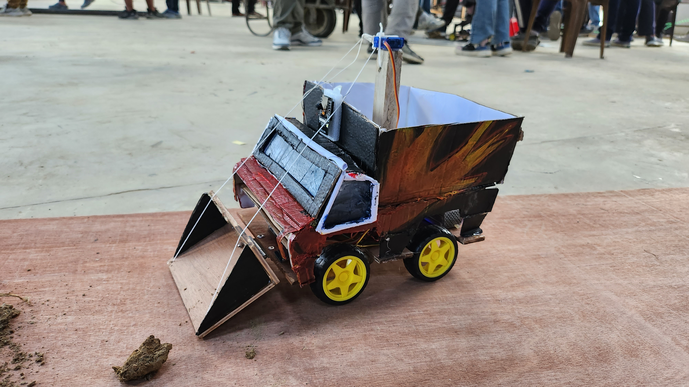

# Mud Clearing Rover Project

## Problem Statement

The ongoing tunnel digging project generates a significant amount of mud that needs to be efficiently cleared from the site. This project aims to provide an automated solution for detecting and clearing mud using computer vision and rover control.

## Project Description

### Approach

To address the mud clearing problem, we adopted the following approach:

1. **Computer Vision with OpenCV:** We utilized the OpenCV library in Python to enable our system to detect mud on the site. OpenCV is a powerful tool for image processing and object recognition, making it an ideal choice for this task.

2. **Rover Control with NodeMCU:** Our system is equipped with a NodeMCU, which serves as the brain of the rover. It controls the rover's movement and actions based on the information received from the computer vision system. When mud is detected, the NodeMCU instructs the rover to collect and transport the mud to the designated dumping site.

3. **Automated Mud Detection:** The computer vision system autonomously identifies mud patches, ensuring a swift and efficient mud clearing process. When mud is detected, the system triggers the rover to collect it and transport it to the appropriate dumping location.

### Team Members

- Akhilesh Kafle (me)
- Arya Ghimire
- Silvica Shrestha
- Dikshant Lamsal

### Limitations

While our project successfully demonstrates the concept, it has some limitations:

- **Lack of AI Integration:** Due to time constraints and the complexity of integrating AI, we were unable to fully implement an AI system. As a temporary measure, we controlled the rover via a web interface, which allowed for remote control and monitoring.

- **Electronics Complexity:** Building a fully autonomous AI system with real-time mud detection is a complex task that requires sophisticated hardware and more development time. Our project serves as a proof of concept, showcasing the potential for future improvements in this area.

- **Controlling code has been missing**

## Contributing

We welcome contributions and improvements to this project. If you have ideas for enhancing the mud clearing system or implementing AI features, please feel free to submit a pull request.
